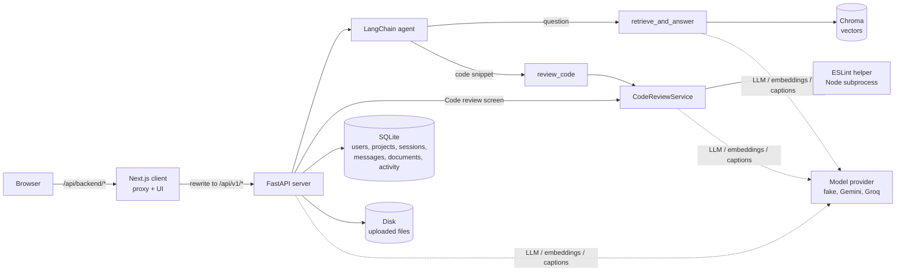
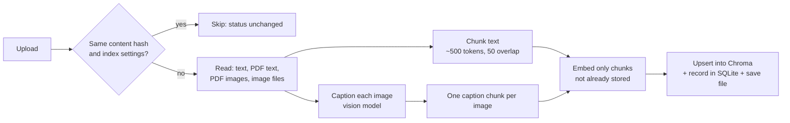

# Architecture

An onboarding assistant for a development team: upload a project's docs, ask questions about them with cited answers,
and get review feedback on pasted React / TypeScript code. Two apps in one repository:

- `client/`: Next.js (App Router) + Tailwind, the only thing the browser talks to.
- `server/`: FastAPI. Owns all data, all model calls and all API keys.

Related: [database design](database.md), [API reference](api.md), [configuration](configuration.md),
[development](development.md).

## System overview



- The browser only ever calls `/api/backend/*` on the Next.js origin. `client/next.config.ts` rewrites that to
  `${BACKEND_URL}/api/v1/*`, so the backend address stays server-side and the session cookie is same-origin.
- Everything stateful lives on the server's machine: SQLite (`data/onboarding.db`), Chroma (`data/chroma/`) and the
  uploaded originals (`data/docs/<project_id>/`). Only model calls leave it.

## Backend layers

The server is layered so that business logic never depends on a vendor SDK or a database driver:

```
api (routes, deps)  ->  services (business flow)  ->  domain ports (interfaces)  <-  infrastructure (adapters)
                         agent (LangChain agent, tools)
```

| Layer | Where | Role |
|---|---|---|
| Domain | `app/domain/models.py`, `app/domain/ports/` | Plain dataclasses and `Protocol` interfaces. No I/O. |
| Infrastructure | `app/infrastructure/*` | One adapter per external system: SQLite stores, Chroma, disk, the ESLint helper, model providers, JWT, bcrypt. |
| Services / agent | `app/services/`, `app/agent/` | The flows (ingestion, chat, code review, projects, auth), written against ports only. |
| API | `app/api/routes/`, `app/api/deps.py`, `app/api/container.py` | Thin HTTP routes. `container.py` is the only place that picks concrete adapters. |

Swapping a provider or a store means writing an adapter for the same port and registering it; callers do not change.
Model providers are chosen by config (`LLM_PROVIDER`, `EMBEDDING_PROVIDER`, `CAPTION_PROVIDER`) through small registries
in `app/infrastructure/*/registry.py`.

## Ownership model

```
user ─┬─ project ─┬─ documents (files on disk + chunks in Chroma + a row in `documents`)
      │           └─ chat sessions ── chat messages
      └─ (profile: name, email, password)
```

- A project has exactly one owner; there is no sharing, membership or roles.
- Every project-scoped route is nested under `/projects/{project_id}` and checks ownership first (`OwnedProjectDep` /
  `OwnedSessionDep` in `api/deps.py`). A project or session that isn't yours is a 404.
- Documents and retrieval are scoped by `project_id` at every level (registry key, disk folder, Chroma metadata filter),
  so one project's content never reaches another project's answers.
- Chat sessions separate conversations within a project; they share the project's documents.

## Main flows

### Login

Signup or login checks the `users` table (bcrypt hashes) and sets an HttpOnly, SameSite=Lax `session` cookie holding a
signed JWT (HS256, `AUTH_SECRET`, `SESSION_TTL_MINUTES`, default 8 h; `Secure` in production). On the client,
`src/proxy.ts` redirects to `/login` when the cookie is missing, the `(app)` layout validates it with `GET /session`,
and any API call that returns 401 sends the browser to `/login`.

### Ingestion (upload a document)



- File names count: each chunk is embedded with its readable file name (the stored text is unchanged), so a question
  can match what a file is named, not only what it says.
- Idempotent: chunk ids are a hash of embedding model + input format + project + source + position + kind + text, so
  re-uploading the same file costs no embedding calls, and a changed file only embeds its changed chunks. Stale chunks
  are removed.
- Deleting a document removes it from the registry, Chroma and disk together.

### Ask (chat)

1. `ChatService` loads the session's latest 50 messages and passes them to the agent as conversational memory.
2. The LangChain tool-calling agent picks one tool from the tools' descriptions: `retrieve_and_answer` for questions,
   `review_code` for pasted code. The tool's result is returned as the reply directly (the model is not called a
   second time to restate it), so a question costs one tool-choice call plus the tool's own calls.
3. `retrieve_and_answer` embeds the question, searches the project's chunks in Chroma (top 4, cosine), and asks the LLM
   to answer from those excerpts only, in Markdown, labelled by file name, saying which file each fact comes from. The
   model ends with a `SOURCES:` line naming the files it used; the tool strips it and cites only those (none when the
   documents don't cover the question; all retrieved files if the model omits the line). If the project has nothing
   indexed it says so without calling the LLM. (There is no relevance threshold: the top 4 chunks are always used.)
4. The user message and the reply are saved to the session, and one activity row is recorded for the dashboard (a
   question, or a review if `review_code` answered).

### Code review

1. The snippet goes to the ESLint helper (`server/lint/lint-snippet.mjs`, Node, run as a subprocess with JSON in and
   out): typescript-eslint parser, `jsx-a11y` recommended rules, React Hooks rules, a few React and core style rules,
   and security rules (`eval` and friends, `dangerouslySetInnerHTML`, `javascript:` URLs, unsafe `target="_blank"`).
   No project config or import resolution is needed.
2. Lint rules map to categories: `jsx-a11y/*` is **accessibility**, the security rules above are **security**,
   everything else **style**.
3. The LLM gets the code plus the lint findings and is asked, as JSON, only for what ESLint can't see: missing
   **tests**, **security** problems such as leaked secrets, accessibility semantics, readability. Missing imports are
   not issues (snippets are standalone), and it may add to an ESLint finding whose real impact is worse (e.g. a
   `console.log` of a password).
4. If the model's reply is not valid review JSON, the result falls back to the ESLint findings and says so
   (`judgement_available: false`). A snippet that doesn't parse is reported and the model is not called.

A pasted **unified diff** (`git diff` output) is detected and reviewed as one (`app/review/diff.py`): for each changed
`.js`/`.jsx`/`.ts`/`.tsx` file, each hunk's new-side code is linted, only findings on added or changed lines are kept
and mapped to the file and its new line number, and the model is asked to comment on the added lines only. Other files
are skipped with a note; a hunk ESLint can't parse on its own (a fragment) is left to the model, also with a note.

The Code review screen calls `POST /projects/{id}/reviews` directly (through `ProjectReviewService`, which also records
an activity row); code pasted into Ask reaches the same reviewer through the agent's `review_code` tool.

### Dashboard

Activity is recorded where it happens (`ChatService` after each turn, `ProjectReviewService` after each review) into
the `activity` table through the `ActivityLog` port. `ActivityService` reads it back for `GET /projects/{id}/stats`:
questions and reviews in the last 7 days and in total, the number of indexed documents, and the latest 10 events. The
Dashboard page shows the current project only.

### Evaluation

`scripts/evaluate.py` runs question and snippet sets through `EvaluationService` with the same agent and reviewer the
app uses, but each question gets no chat history and nothing is recorded to history or activity. Per case it writes
the answer, the retrieved and cited files, findings by source and category, the time taken, and the model calls
made, counted by the real adapters in `app/infrastructure/model_calls.py` (one per request, including rate-limited
attempts and fallbacks).

## Frontend structure

Atomic design under `client/src/components/` (atoms, molecules, organisms, templates), pages in `src/app/(app)/`.
Shared state is held by providers in the `(app)` layout, nested
`ProjectProvider > ProjectDocumentsProvider > ChatSessionProvider > ChatProvider`: the current project, its documents,
its chat sessions and the current conversation. All HTTP goes through `src/lib/api/http.ts`.

What is restored after a reload: the current project comes from the server (`last_project_id`); the chat session last
open in each project is remembered in the browser's localStorage (`last-chat-session:<project id>`), falling back to
the first session if it no longer exists or storage is unavailable; panel collapse states are also localStorage.

## Model providers: current status

| Port | Used for | `fake` | Real adapters |
|---|---|---|---|
| `Embedder` | Chunk and query embeddings | Hashes words into 256-d vectors (shared words = similar) | **Gemini** (`GEMINI_EMBEDDING_MODEL`, default `gemini-embedding-001`) |
| `ImageCaptioner` | Captions for images at ingestion | Describes the image by type, size and hash | **Gemini** vision (`GEMINI_MODEL`) |
| `LLMClient` | Answers, review judgement | Echoes the prompt | **Gemini** (`GEMINI_MODEL`), **Groq** (`GROQ_MODEL`); OpenRouter: stub, not implemented |
| Chat model (LangChain) | The agent's tool choice | Code-looking input to `review_code`, else the first tool | **Gemini** (`GEMINI_MODEL`), **Groq** (`GROQ_MODEL`); OpenRouter: stub, not implemented |

`fake` is the default: no API keys, no network. With `gemini`, all Gemini adapters share one chat model setup
(`app/infrastructure/gemini/`):

- **One text model** (`GEMINI_MODEL`) answers questions, judges code, picks the agent's tool and captions images.
- **Fallback model** (`GEMINI_FALLBACK_MODEL`, optional): if the main model returns a rate-limit or quota error, the
  same request is retried once on the fallback, which has its own separate free quota.
- **Errors** become the app's own: a rate limit is `429 model_rate_limited`; a rejected key, unknown model or outage
  is `502 model_provider_error` with a readable message.
- **Streaming is off** on the chat models: the agent calls the model through `astream`, which would otherwise bypass
  the error mapping and the fallback. Replies are never streamed to the browser anyway.
- **Provider fallback** (`LLM_FALLBACK_PROVIDER`, optional, e.g. `groq`): when every Gemini model is rate-limited, the
  answer, review judgement and tool choice move to that provider (`app/infrastructure/groq/`, same error mapping).
  Embeddings and captions stay on Gemini, since the vector index is tied to one embedding model.
- **Embeddings** are sent in groups that stay under `GEMINI_EMBEDDING_TOKENS_PER_MINUTE`, pausing a minute between
  groups, so a large upload is slower rather than rejected.
- Each embedding model has its **own Chroma collection**, because vectors of different sizes can't share one.
  Switching `EMBEDDING_PROVIDER` or the embedding model starts from an empty index; re-upload the documents.

ESLint is real in every mode: it runs locally and needs no API key.

## Known limitations

- **OpenRouter is not implemented**. Groq serves text only; Gemini is the only embedding and caption provider.
- **Dashboard** covers the current project only, and counts start from when activity recording was added.
- **Retrieval** always uses the top 4 chunks, with no relevance threshold; unrelated questions still reach the model,
  which is told to say it doesn't know.
- **Chat memory** covers the latest 50 messages of a session.
- **Reviews** are not stored; the Code review screen keeps only the latest result, in the browser.
- **No deletion** of projects, chat sessions or accounts, and **no renaming** of sessions, through the API.
- **No login rate limiting**, and no password reset in the app (operator script only).
- **Creating a project** writes the project and its first session separately, not in one transaction; a failed
  session write deletes the project again rather than leaving it without a session.
- **SQLite and Chroma** suit one server process on one machine; they are not set up for several instances.
