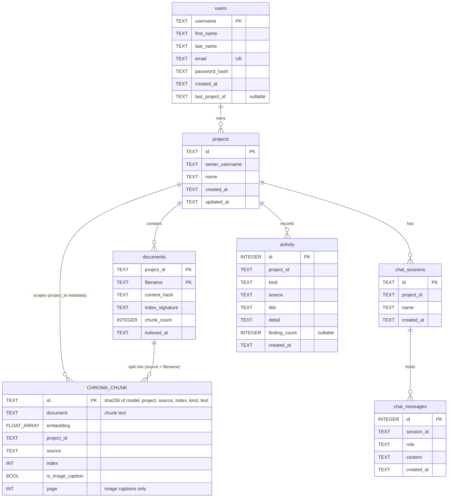

# Database design

The server keeps three kinds of data, all under `DATA_DIR` (default `server/data/`, git-ignored):

| Store | Location | Holds |
|---|---|---|
| SQLite | `data/onboarding.db` | Users, projects, chat sessions, chat messages, the documents registry, activity |
| Chroma (persistent) | `data/chroma/` | Document chunks: text, embedding and metadata |
| Disk | `data/docs/<project_id>/<filename>` | The original uploaded files |

Each SQLite table belongs to one adapter in `server/app/infrastructure/storage/`, which creates it on first use
(`CREATE TABLE IF NOT EXISTS`). There is no migration tool; schema changes are additive or handled by hand.
Timestamps are ISO 8601 strings in UTC. IDs are UUID4 strings.

Related: [architecture](architecture.md), [API reference](api.md).

## Entity relationships

The relationships are enforced by the services, not by SQL foreign keys: ownership is checked in `ProjectService` and
`ChatSessionService` before any project or session data is read or written.

## SQLite tables

### `users`

| Column | Type | Notes |
|---|---|---|
| `username` | TEXT PK | 3 to 50 characters, fixed after signup |
| `first_name`, `last_name` | TEXT | Editable on the Account page |
| `email` | TEXT UNIQUE | Fixed after signup |
| `password_hash` | TEXT | bcrypt |
| `created_at` | TEXT | |
| `last_project_id` | TEXT NULL | The project to reopen after the next login |

### `projects`

| Column | Type | Notes |
|---|---|---|
| `id` | TEXT PK | UUID |
| `owner_username` | TEXT | The only user who can see or change it. Index `idx_projects_owner` |
| `name` | TEXT | Renamable |
| `created_at`, `updated_at` | TEXT | |

### `documents`

The registry of what is indexed per project; it drives the docs list and makes ingestion idempotent.

| Column | Type | Notes |
|---|---|---|
| `project_id`, `filename` | TEXT, composite PK | One row per file per project; re-uploading a name replaces it |
| `content_hash` | TEXT | sha256 of the uploaded bytes |
| `index_signature` | TEXT | Embedding model + chunk settings; a change forces a re-index |
| `chunk_count` | INTEGER | Text chunks plus image-caption chunks |
| `indexed_at` | TEXT | |

### `chat_sessions`

| Column | Type | Notes |
|---|---|---|
| `id` | TEXT PK | UUID |
| `project_id` | TEXT | Index `idx_chat_sessions_project (project_id, created_at)` |
| `name` | TEXT | "Session 1" is created with every project |
| `created_at` | TEXT | |

### `chat_messages`

| Column | Type | Notes |
|---|---|---|
| `id` | INTEGER PK AUTOINCREMENT | Also the message order |
| `session_id` | TEXT | Index `idx_chat_messages_session (session_id, id)` |
| `role` | TEXT | `user` or `assistant` |
| `content` | TEXT | |
| `created_at` | TEXT | |
| `sources` | TEXT (JSON list) | Files an assistant answer cited, `[]` otherwise; added to older databases on start-up |

The most recent 50 messages of a session (oldest first) are passed back to the agent on each turn as its memory, and
are what the history endpoint returns; older ones stay stored.

### `activity`

One row per question asked or review run, recorded as it happens; the dashboard's counts and recent list are read
from here (`GET /projects/{id}/stats`).

| Column | Type | Notes |
|---|---|---|
| `id` | INTEGER PK AUTOINCREMENT | |
| `project_id` | TEXT | Index `idx_activity_project (project_id, created_at)` |
| `kind` | TEXT | `question` or `review` |
| `source` | TEXT | `ask` (chat, including code pasted into chat) or `code_review_screen` |
| `title` | TEXT | The question, "Reviewed: " + the snippet's first line, or "Reviewed diff: " + the changed files; at most 120 characters |
| `detail` | TEXT | Start of the answer or the review summary, one line, at most 200 characters |
| `finding_count` | INTEGER NULL | Reviews from the Code review screen only |
| `created_at` | TEXT | |

## Chroma

One persistent collection per embedding model, named `documents-<model>` (for example
`documents-gemini-embedding-001`), cosine distance, with embeddings supplied by the app's own `Embedder` (Chroma's
built-in embedding function is off). A collection's vector size is fixed by its first insert, so each embedding model
needs its own; switching models starts with an empty index for that model.

- **Scoping:** every chunk carries `project_id` in its metadata and every query, lookup and delete filters on it.
- **Chunk id:** sha256 of embedding model + embedding input format + project + source + chunk index + whether it is an
  image caption + text.
  The same content always maps to the same id, so a re-upload upserts in place and only new chunks are embedded; ids
  also change when the embedding model changes, so old vectors are never reused.
- **Metadata:** `project_id`, `source` (the filename), `index`, `is_image_caption`, and `page` for image captions.

## Operations that touch more than one store

| Operation | Stores touched | Order |
|---|---|---|
| Upload a document | Chroma, disk, `documents` | Embed and upsert new chunks, remove stale ones, save the file, record the row last |
| Delete a document | `documents`, Chroma, disk | Registry row first (404 if the file isn't indexed), then its chunks, then the file |
| Create a project | `projects`, `chat_sessions` | Project first, then its "Session 1"; if the session write fails, the project row is deleted again (`ProjectSetupService`) |
| Chat turn | `chat_messages`, `activity` | Both messages, then one activity row |

Projects, sessions and users cannot be deleted through the API yet.
